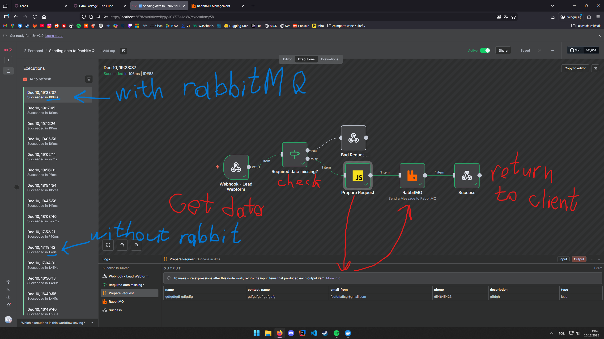
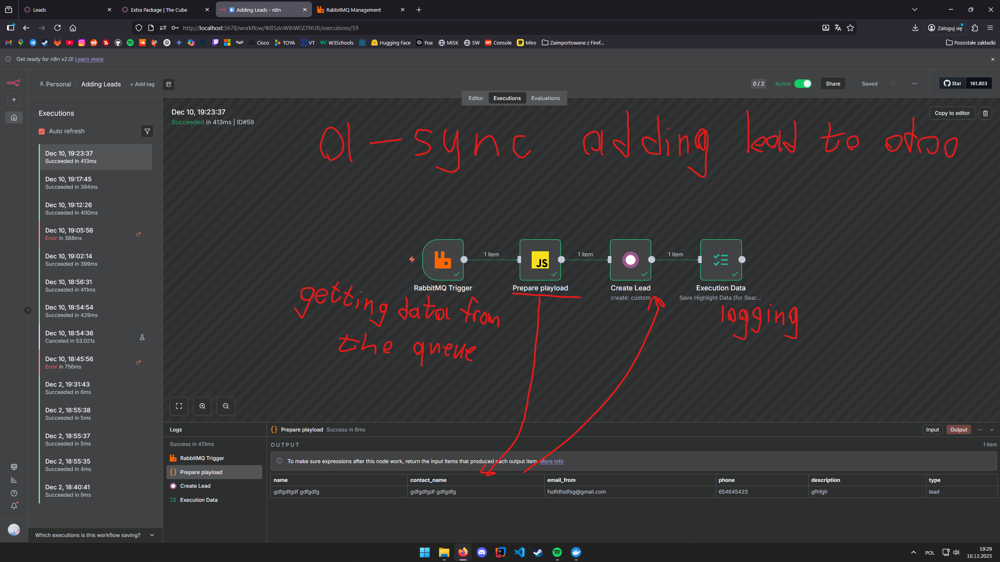
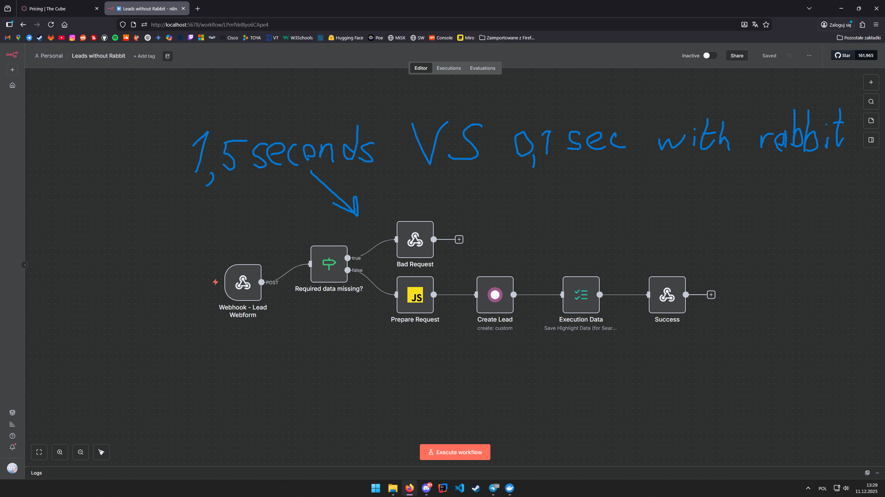

# ERP System for 3D Production Company  
**Odoo v19 | n8n | RabbitMQ | Stripe | JavaScript**

---

## 📌 Overview

This project is a fully functional **ERP system** built on **Odoo v19** for a fictional company specializing in **3D modeling and scene creation**.

The system simulates a real-world business workflow — from **client acquisition and service purchase** to **automated data processing, CRM integration, invoicing, and payment handling**.

---

## 🚀 Key Features

- 🌐 Full company website built with Odoo
- 🛒 Service purchase system with real payment integration (**Stripe**)
- 🔗 Integration with **n8n workflows**
- ⚡ Asynchronous data processing using **RabbitMQ**
- 📊 CRM system with automatic lead creation
- 💳 Payment and invoice management
- 🧾 Automatic invoice generation
- 📧 Custom email campaign module (built from scratch)

---

## 🏗️ System Architecture

The system is designed as a **distributed workflow pipeline**:

1. Client submits service request via website  
2. Custom JavaScript script sends data to n8n workflow  
3. Workflow processes and sends data to RabbitMQ queue  
4. Second workflow consumes data asynchronously  
5. Data is stored in Odoo (CRM / database)  
6. Invoice and payment flow handled via Stripe integration  

---

## 🔄 Data Processing Flow

Website → JS → n8n → RabbitMQ → n8n → Odoo (CRM + DB)

## ▶️ Setup Instructions

Follow these steps to run the project locally:

---

### 1. Start Docker

Make sure Docker and Docker Compose are installed and running.

---

### 2. Run containers

Navigate to the folder with the docker-compose.yml file and run:

    docker compose up -d

This will start all required services (Odoo, PostgreSQL, n8n, RabbitMQ, Mailpit).

---

### 3. Restore Odoo database

1. Open Odoo: http://localhost:8069  
2. Click "Restore Database" (do NOT create a new one)  
3. Upload the provided .zip backup  
4. Check the option indicating the database has been moved  
5. Enter required credentials and restore the database  

---

### 4. Configure RabbitMQ

1. Open RabbitMQ panel: http://localhost:15672  
2. Login:  
   - username: admin  
   - password: admin123  

3. Create a new queue:
   - name: leads  
   - keep all other settings as default  

---

### 5. Import n8n workflows

1. Open n8n: http://localhost:5678  
2. Click "+" → "Import" → "From File"  
3. Import the provided workflow files  

---

### 6. Configure n8n credentials

RabbitMQ:
- Host: rabbitmq

Odoo:
- Host: http://web:8069  
- Login: your Odoo user email  
- API Key: generate in Odoo → User → Preferences → Security  

---

### 7. Verify setup

Run:

    docker ps

If everything is configured correctly:
- Website works  
- Data flows through n8n  
- Messages appear in RabbitMQ  
- Leads appear in Odoo  

---

## 🛑 Stop the project

    docker compose down

## ⚡ Performance Optimization

The system includes a comparison of synchronous vs asynchronous processing:

### With RabbitMQ (asynchronous)
- ⏱ ~100 ms processing time  
- Non-blocking, scalable architecture  

### Without RabbitMQ (synchronous)
- ⏱ ~1.5 seconds processing time  
- Blocking request flow  

---

## 📸 Screenshots

### n8n Workflow with RabbitMQ

### n8n Workflow without RabbitMQ

---

## 🧩 Custom Odoo Module

Developed a custom module for email campaign management, allowing:

- Sending emails instantly  
- Scheduling campaigns  
- Managing communication with clients directly inside ERP  

---

## 🧾 ERP Modules Configuration

Configured and integrated key Odoo modules:

- CRM (lead management)  
- Sales  
- Invoicing  
- Payments  
- Automatic invoice generation  
- Customer database management  

---

## 💳 Payment Integration

Implemented full Stripe integration, enabling:

- Real payment processing  
- Seamless service purchase flow  
- Automatic connection with ERP (orders, invoices)  

---

## 🛠️ Technologies Used

- Odoo v19  
- Python (Odoo backend)  
- JavaScript (frontend integration)  
- n8n (workflow automation)  
- RabbitMQ (message queue)  
- Stripe API  
- PostgreSQL  

---

## 🎯 Key Concepts Demonstrated

- ERP system implementation  
- System integration (Odoo + n8n + RabbitMQ)  
- Asynchronous architecture  
- Queue-based processing  
- Payment system integration  
- Workflow automation  
- Backend + frontend interaction  
